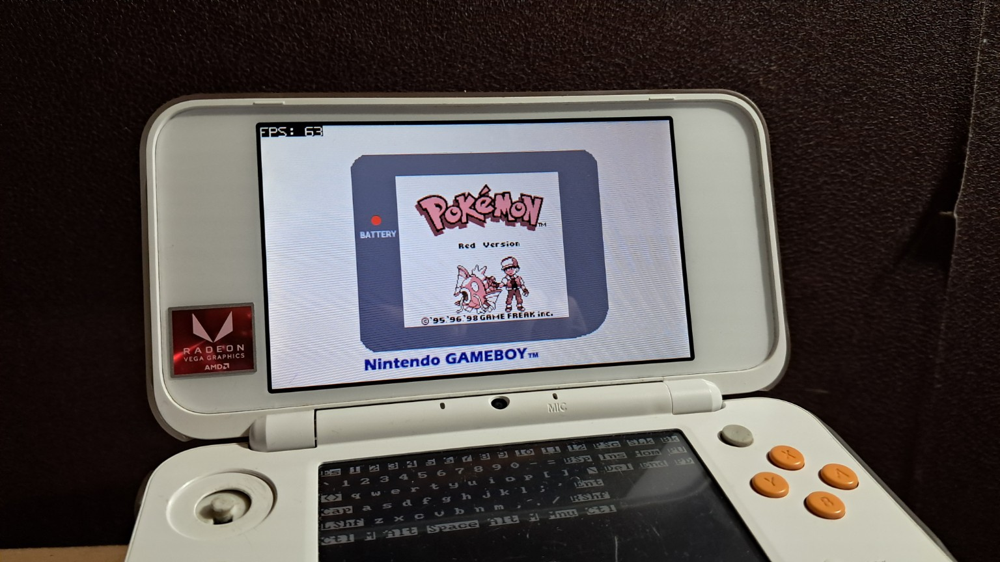
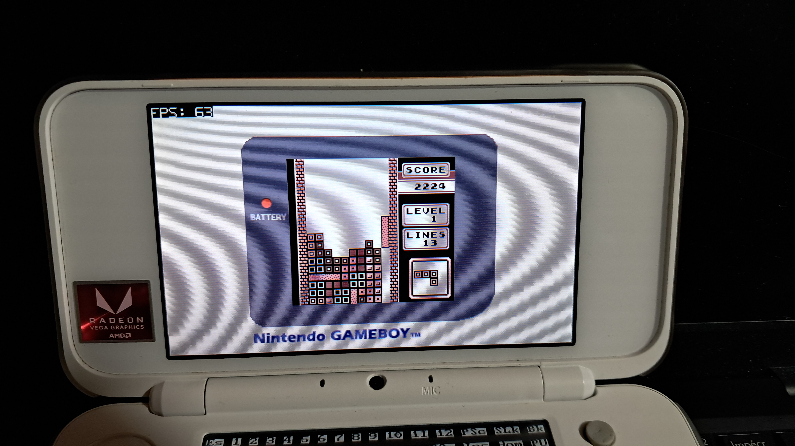

# gb3ds
## A GameBoy Emulator for the 3DS running under Linux.

-----------------

#### Note: most of the rendering/input/fps code is just modified functions i already used in another Linux3DS projet ([3ds-fbge](https://github.com/AtexBg/3ds-fbge), will be refered incode as *linux3ds-lib*) and emulator core is from [@deltabeard's](https://github.com/deltabeard) [gameboy-c](https://github.com/deltabeard/gameboy-c/) emulator.

## USAGE:
**IMPORTANT:** You will first need to install Linux on your 3DS, use this [provided optimized distro](https://github.com/AtexBg/3ds-fbge/releases/download/v0.1.0/linux_3ds-fbge_install.zip) and extract it to the root of your SD card.

To compile this code, you need :

A computer running Linux (or WSL on Windows)
the packages `build-essential`, `make` and `arm-linux-gnueabi-gcc` (ARM cross-compiler) installed

Then compile the project on the "*src/*" folder using the `make` command, or just download the binary in the releases tab, then execute `/switch.sh` (little system script to mount SD and populate **/dev**), then **cd** to /mnt (aka your SD card) and execute the program with your rom file as "-f" argument (example: `./gb3ds -f pokemon_red.gb`)

## CONTROLS:
Same as the GameBoy, but the Select button isn't mapped by the kernel so you'd have to use **X** instead, also click on **L** to leave emulation and **R** to reload game.

## COMPATIBILITY:

> All tests were done on New3DS, could not work on Old models, if you try on Old3DS compile with `make old` instead.

Basic games (Like *Tetris* or *Pokemon Red/Blue*) works perfectly (saves included), GameBoy Color games like *Pokemon Crystal* or *PK Pinball* could not work or have glitched graphics.

###### Little fun fact: the emulation is so accurate and working that i managed to do an ACE glitch and finish PokemonRed in 1m30 on my own emulator :3

## TODO:
- Add OSD menu with the following features:
	- Change current color palette
	- Change background border
	- Change screen size/position
	- Maybe other things....
	
- ~Add sound support~ (the 3ds Linux kernel DOESN'T support sound)
- Make (almost) every game work

- Some more settings

